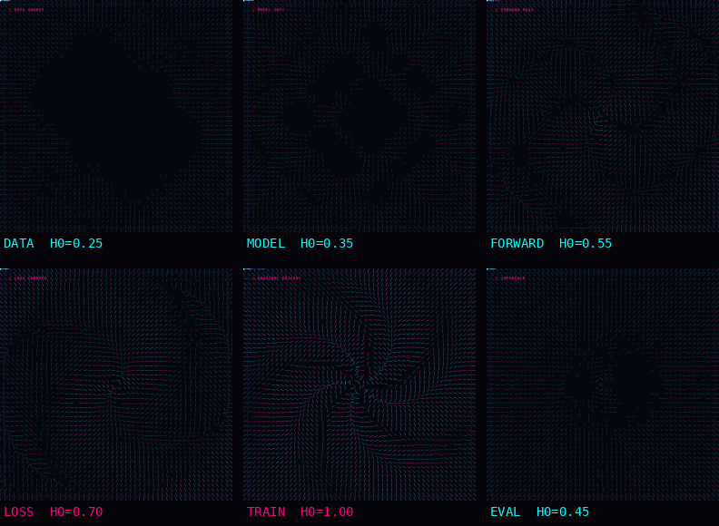

# 🔱 ZKAEDI PRIME // SPRITE FIELDS

Deterministic Hamiltonian energy fields • 16px grid • bloom + showcase.

**[LIVE DEMO](https://izkaedi-ui.github.io/zkaedi_animates/)** • branch `feat/sprite-showcase`

**Gates:** XML ✓ Provenance ✓ Viewer (1×<use>) ✓ Visibility ✓ Monotonicity ✓ (floor 5.0)

A browser-based rigging and animation studio for `.glb` / `.gltf` character meshes.
It combines auto-rigging, FK/IK posing, weight painting, procedural motion, mesh tools,
and one-click export into a single self-contained HTML experience.

## What you can do

- Load a `.glb` or `.gltf` model by drag-and-drop or file picker
- Auto-rig limb-friendly meshes with PCA-aligned limb recognition
- Pose characters with FK controls, CCD IK, mirror tools, and joint handles
- Paint skin weights directly on the mesh with live heatmap feedback
- Animate with built-in procedural motion presets and bake them into a clip
- Add secondary dynamics for tails, hair, wings, and similar chains
- Capture turntable recordings, snapshots, and contact sheets
- Export the result as animated GLB, pose JSON, OBJ, STL, PLY, PNG, or WEBM
- Build low-poly previews, convex hull proxies, and x-ray style previews

## Repository contents

- `zkaedi_rigger.html` — the standalone rig studio
- `zkaedi-prime-blueprint-animation.skill` — the Claude Skill package
- `.github/workflows/copilot-setup-steps.yml` — Copilot setup workflow for the repo

## Quick start

1. Open `zkaedi_rigger.html` in a modern Chromium-based browser.
2. Load a `.glb` or `.gltf` model.
3. Pick a rig template or use **Auto-Rig Loaded Mesh**.
4. Pose, paint, animate, and export.

If your browser blocks module imports from `file://`, serve the repository over HTTP
with any local static server.

## Features at a glance

### Rigging and posing

- Rig templates and pose presets
- Auto-rigging for unskinned meshes
- FK joint editing and CCD IK chains
- Mirror, reset, and bind-pose controls
- Joint tree, handles, and timeline playback

### Motion and deformation

- Procedural motion presets: idle, walk, run, wave, look, jacks
- Bake procedural motion into keyframes for export
- Secondary spring dynamics for appendages
- Weight painting with normalized influences
- Chain shaping and limb refinements

### Output and capture

- Animated GLB export
- Pose library export as JSON
- OBJ / STL / PLY mesh export
- Snapshot PNG export
- Turntable WEBM capture
- Multi-angle contact-sheet PNG export

## Technical notes

- The UI uses `three.js` r160 from jsDelivr.
- Google Fonts are loaded from the network.
- Exports are performed client-side in the browser.
- WebGL is required.

## License

See the repository for license terms.
